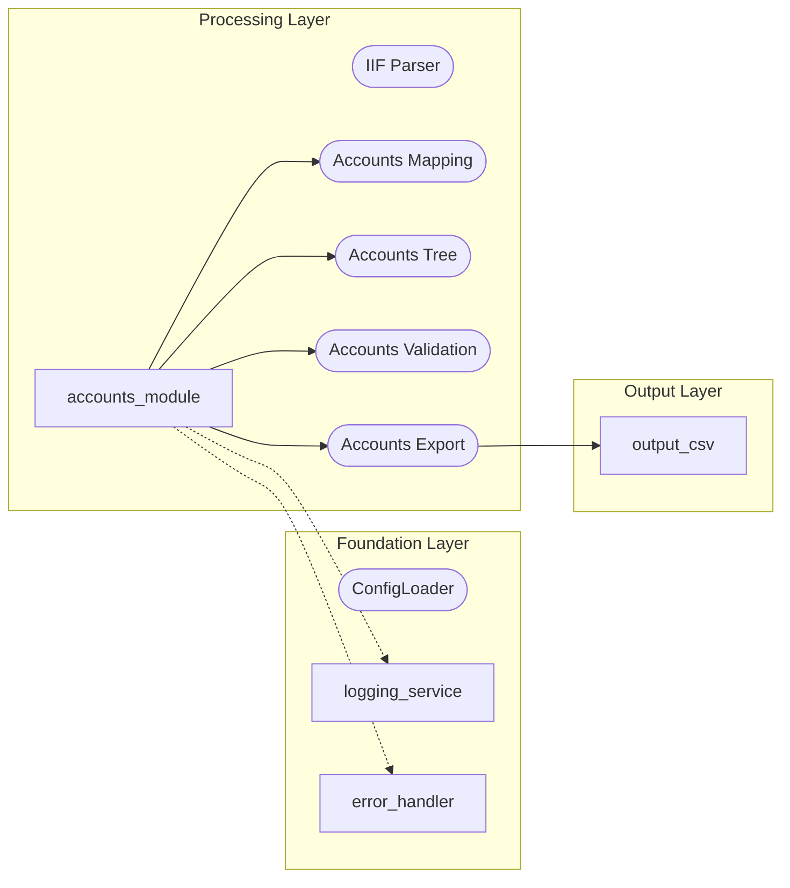
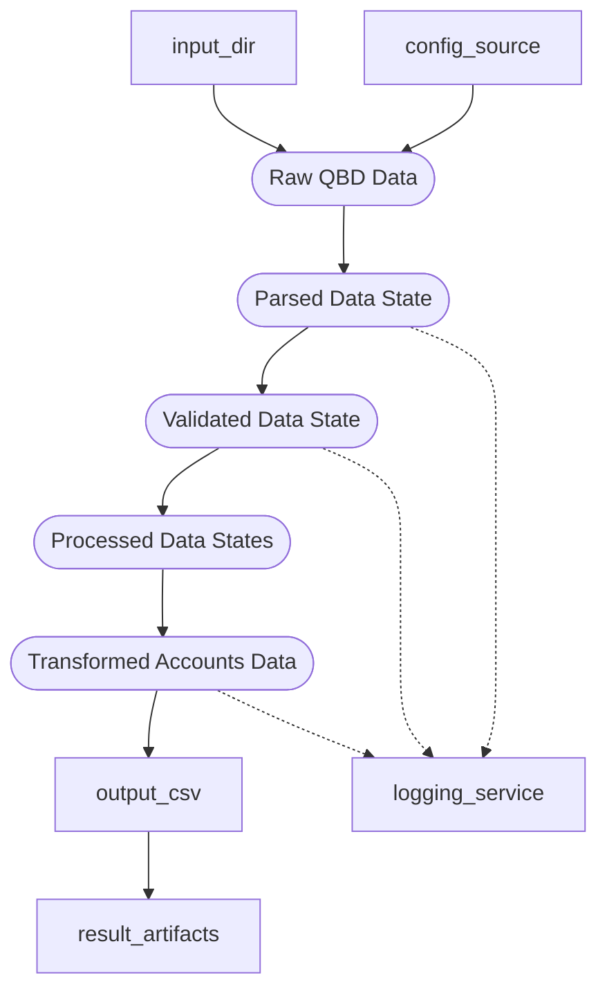
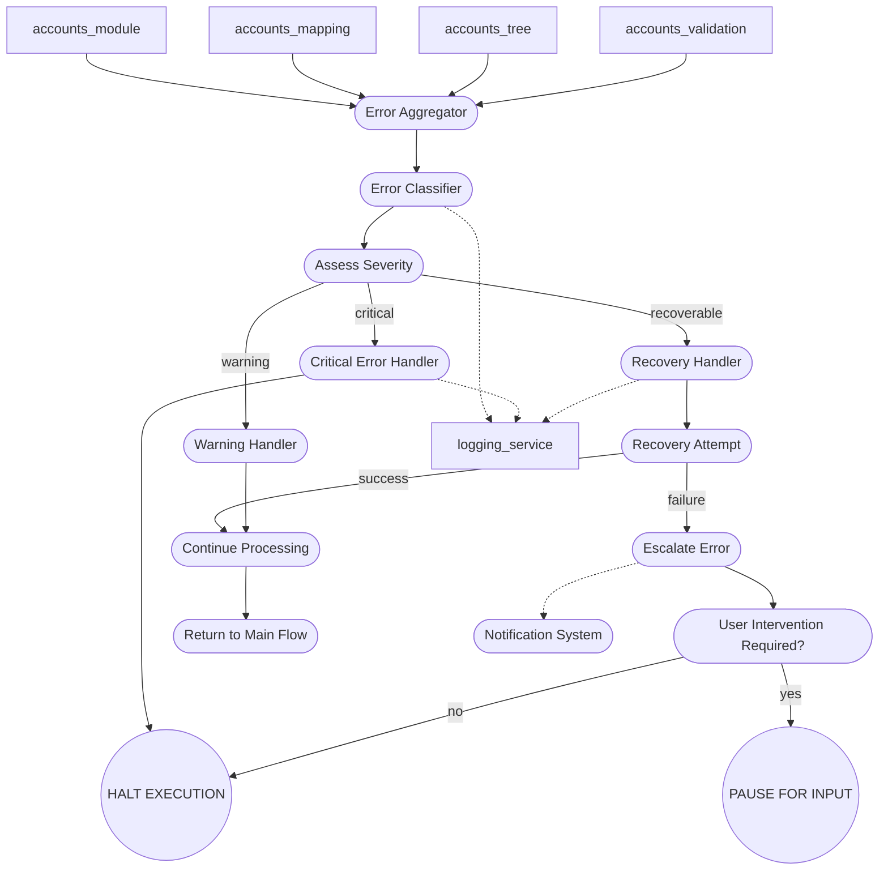
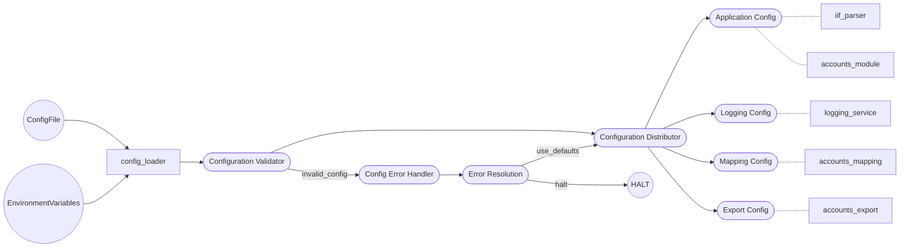

# Logical Flow Diagram (LFD)

---

## 1. System Overview Diagram
```mermaid
graph TD
    %% Source: core-ir-main-v3.9.1.md, Section 2, 6, 8
    subgraph "Input Processing"
        input_dir(["Input Directory"])
        config_source(("Configuration"))
        input_discovery(["Input Discovery"])
        input_dir -->|"IIF files"| input_discovery
        config_source --> input_discovery
        input_discovery --> section_processing(["Section Processing"])
    end
    %% Source: core-ir-main-v3.9.1.md, Section 2, 6
    subgraph "Core Processing"
        section_processing ==> dispatch_flow(["Dispatch Flow"])
        dispatch_flow ==> accounts_module(["Accounts Module"])
        dispatch_flow ==> other_modules(["Other Domain Modules"])
    end
    %% Source: core-ir-main-v3.9.1.md, Section 2
    subgraph "Output Generation"
        accounts_module --> accounts_export(["Accounts Export"])
        accounts_export --> output_csv({"accounts.csv"})
        output_csv --> result_artifacts(["Result Artifacts"])
    end
    %% Source: module-prd-logging-v1.0.5.md, utils.error_handler
    subgraph "Utilities"
        error_handler([["Error Handler"]])
        logging_service([["Logging Service"]])
    end
    %% Dependency edges
    accounts_module -.-> logging_service
    accounts_module -.-> error_handler
    accounts_export -.-> logging_service
    accounts_export -.-> error_handler
    %% Comments for dependencies
    %% accounts_module depends on logging_service and error_handler (schema, PRD)
    %% accounts_export depends on logging_service and error_handler (schema, PRD)
```

---

## 2. Detailed Execution Flow
```mermaid
graph TD
    %% Source: core-ir-main-v3.9.1.md, Section 2, 4, 5
    start((START)) --> init(["Initialization Sequence"])
    init --> validation(["Validation Gate"])
    validation -->|"valid"| processing(["Processing Pipeline"])
    validation -->|"invalid"| error_handler
    processing --> business_logic(["Business Logic Decisions"])
    business_logic -->|"accounts"| accounts_path(["Accounts Path"])
    business_logic -->|"other domain"| other_path(["Other Domain Path"])
    accounts_path --> output_gen(["Output Generation"])
    other_path --> output_gen
    output_gen --> completion(["Completion Check"])
    completion -->|"more sections"| processing
    completion -->|"complete"| end((COMPLETE))
    accounts_path -.-> logging_service
    output_gen -.-> logging_service
    accounts_path -->|"error"| error_handler
    output_gen -->|"error"| error_handler
    error_handler --> recovery(["Recovery Decision"])
    recovery -->|"recoverable"| processing
    recovery -->|"critical"| halt((HALT))
    %% Comments: All error and logging flows per PRD and schema
```

---

## 3. Module Dependency Graph


---

## 4. Data Flow Diagram


---

## 5. Error Flow Diagram


---

## 6. Configuration Flow Diagram


---

## Legend
- **[Node Types]**
  - [Module Name]: Processing modules
  - ((Decision Point)): Branching logic
  - {Result File}: Output artifacts
  - [[Utility Service]]: Shared services (logging, error handler)
  - (Configuration): Config nodes
- **[Edge Types]**
  - `-->`: Data flow (with labels where allowed)
  - `==>`: Control flow (no label)
  - `-.->`: Dependency (no label)
  - `..>`: Error propagation (no label)
  - `-.-`: Configuration flow (no label)
- **All nodes and edges are cross-referenced to authoritative PRD, schema, or meta-file sources via Mermaid comments.**
- **All edge and node names are consistent across diagrams.**
- **Logging and Error Handler are global utilities with multiple inbound edges.**
