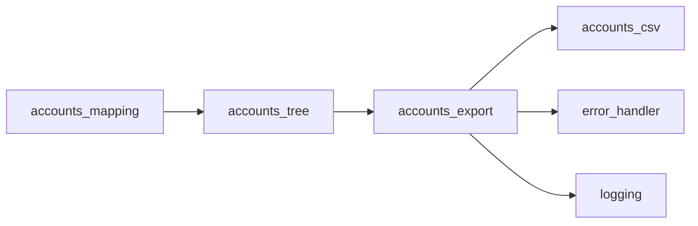

### **Prompt for Local Agent: Logical Flow Canonicalizer (LFC)**
### Version: 1.1.14
#### 1. **Compliance References**
- **Core PRD Document:** `core-prd-main-v3.6.5.md`
- **Governance Document:** `prd-governance-model-v2.3.10.md`
- **Logging Framework Module PRD:** `module-prd-logging-v1.0.4.md`

---

#### 2. **Objective**
You are tasked with constructing a **Logical Flow Canonicalizer (LFC)** that formalizes execution order, dependencies, interfaces, state transitions, and modular orchestration, ensuring deterministic code generation and eliminating ambiguity in system flow.

**Key Terms:**
- **LFC** = Logical Flow Canonicalizer (this system)
- **LFD** = Logical Flow Diagram (output artifact)
- **IR** = Intermediate Representation (schema layer)

Your directives are **strict**:  
✅ **DO enforce compliance with PRDs and governance mandates**  
✅ **DO ensure logging is fully integrated as a structured execution component**  
✅ **Place all generated files directly into the `result-files` directory**—**no output should be presented exclusively in chat**  
✅ **Modify files inline** within their designated locations—**no external drafts or temporary deliverables**  
🚫 **DO NOT infer execution order beyond authoritative source definitions**  
🚫 **DO NOT alter module relationships beyond structured dependencies**  

---

#### 3. **Source Authority Hierarchy**
**All system logic, execution ordering, interface contracts, validation mechanisms, and dispatch structures must be derived from these authoritative sources in order of precedence:**

**3.1 Primary Sources (Highest Authority)**
- **PRDs** (`./prd/core-prd-main-v3.6.5.md`, `./prd/module-prd-logging-v1.0.4.md`, etc.) → Define operational compliance, validation rules, interface contracts

**3.2 Secondary Sources (Implementation Guidance)**  
- **Meta-Files** (`./build/logical_flow_canonicalizer/meta-files/`) → Define structured execution mappings, interdependencies, orchestration sequences
- **IR Schema** (`./build/logical_flow_canonicalizer/schema/`) → QBD-to-GnuCash Intermediate Representation Schema files

**3.3 Resolution Protocol**
When conflicts arise between sources:
1. **PRD supersedes all other sources**
2. **Meta-files supersede IR Schema**  
3. **If gap exists between PRD and implementation sources → HALT execution and generate halt report**

The agent **is prohibited from making assumptions** outside of formal definitions. If a logical gap exists, **execution halts** until the discrepancy is explicitly resolved.

---

#### 4. **Pre-Execution Compliance Verification**
Before proceeding, you **must**:

**4.1 Scan Required Documents**
- `core-prd-main-v3.6.5.md` (Core PRD rules & constraints)
- `prd-governance-model-v2.3.10.md` (Governance policies)  
- `module-prd-logging-v1.0.4.md` (Logging facility structure)

**4.2 Generate Compliance Declaration**
Create `result-files/lfc_compliance_declaration.md` containing:
- Verification timestamp
- Document versions accessed
- Compliance gaps identified (if any)
- Authorization to proceed (or halt directive)

**Proceed only after successful compliance verification.**

---

#### 5. **Key Deliverables**

##### 5.1 **Master Module Table (`result-files/master_module_table.md`)**  
**Purpose:** Comprehensive registry of all system modules with dependencies and validation status

**Requirements:**
- Derive from **IR Schema** in `./build/logical_flow_canonicalizer/schema/`
- Cross-validate against **PRD specifications**
- Map each module to its Jinja template (e.g., `class.py.jinja`, `module.py.jinja`, `function.py.jinja`, `interface_impl.py.jinja`).
- Include columns: Module Name, Dependencies, Entry Points, I/O Contracts, Validation Status, PRD Reference, Codegen Template
- Flag any schema entries lacking PRD validation
- Use [glossary linking](glossary.md#master-module-table) for technical terms

**Example Structure:**
````markdown
# Master Module Table

| Module Name | Dependencies | Entry Points | I/O Contracts | Validation Status | PRD Reference | Codegen Template     |
|-------------|--------------|--------------|---------------|-------------------|---------------|----------------------|
| ...         | ...          | ...          | ...           | ...               | ...           | module.py.jinja      |
````

##### 5.2 **Logical Flow Diagram (`result-files/lfd.md`)**  
**Purpose:** Visual representation of system execution flow and dependencies

**Requirements:**
- **Must be emitted as Mermaid.js code blocks** within Markdown
- Each node = module/function/result artifact; each edge = dependency, execution flow, or data/result flow  
- **Explicitly represent all global utilities (e.g., Error Handler, Logging) as dependencies for every consuming module, not just a single module.**
- **Explicitly represent all data/result flows:**  
  - Every output defined in the IR schema or PRD (including result files, data handoffs, and feedback to orchestrators) must be shown as an edge in the diagrams.
  - Nodes must be created for all result artifacts (e.g., `accounts.csv`, log files) and for any intermediate data structures that are passed between modules.
  - If a module’s output is used as input for another module, this must be shown as a direct edge.
- **Show feedback and completion flows:**  
  - If a module signals completion or passes control/data back to an orchestrator or dispatcher, this must be represented.
  - Feedback loops (e.g., validation failures leading to re-processing) must be included if defined in the IR schema or PRD.
- **Differentiate edge types:**  
  - Use different edge styles or labels to distinguish between control flow, data/result flow, and utility dependencies (e.g., dashed for logging/error, solid for data, dotted for control).
- **Legend and node types:**  
  - The legend must explain all node types (modules, result files, orchestrators, utilities) and all edge types (data flow, control flow, utility dependency).
- **Enforce IR schema contract visualization:**  
  - For every module, all declared inputs and outputs in the IR schema must be represented as incoming and outgoing edges in the diagrams.
  - If any contract is not visualized, halt and report the gap.
- **Generate two distinct Mermaid diagrams:**
  - **Execution Flow (`graph TD`)**: Shows the order of operations (e.g., Input Discovery → Section Processing → Dispatch Flow → Module), including all data/result flows and feedback/completion flows.
  - **Dependency Graph (`graph LR`)**: Shows all module-to-module, module-to-utility, and module-to-artifact dependencies, regardless of execution order. **All utility consumption relationships and data/result flows must be included as direct edges.**
- **Validate the dependency graph against the Master Module Table and IR schema:**
  - **Every module's declared dependencies and I/O contracts in the Master Module Table and IR schema must be reflected as edges in the Mermaid dependency graph.**
  - After diagram generation, cross-check all dependencies and I/O contracts listed in the Master Module Table and IR schema against the edges in the Mermaid dependency graph. **Flag or halt if any declared dependency or contract is missing.**
- Include legend explaining node types and edge meanings, and clarify that some nodes (like Error Handler and Logging) are global utilities with multiple inbound edges. The legend must also explain edge styles/labels.
- Validate against [topological ordering](glossary.md#topological-sort) requirements
- Include both high-level system flow and detailed module interactions

**Example Structure:**
````markdown
# Logical Flow Diagram (LFD)

## System Overview
```mermaid
graph TD
    input_discovery --> section_processing
    section_processing --> dispatch_flow
    dispatch_flow --> iif_parser
    iif_parser --> dispatch_flow  %% Feedback/data flow
    dispatch_flow --> accounts
    accounts --> accounts_mapping
    accounts_mapping --> accounts_tree
    accounts_tree --> accounts_export
    accounts_export --> accounts_csv  %% Result file node
    accounts_export --> dispatch_flow  %% Completion signal
    accounts_export --> error_handler
    accounts_export --> logging
    %% ...other flows...
```

## Detailed Module Dependencies

Legend: Node types: modules, result files, orchestrators, utilities. Edge types: solid = data/result flow, dashed = utility dependency, dotted = control/feedback. All dependencies and I/O contracts in this graph must match those declared in the [Master Module Table](master_module_table.md#master-module-table) and IR schema. If any contract is missing, halt and report the gap.
````

##### 5.3 **LFC Contribution Manifest (`result-files/lfc_contribution_manifest.md`)**  
**Purpose:** Index of all source files contributing to LFC generation

**Requirements:**
- Scan `build/logical_flow_canonicalizer/meta-files/` and `build/logical_flow_canonicalizer/schema/`
- List file paths, modification dates, and contribution type
- **Preserve actual content in source directories** - manifest is index only

##### 5.4 **LFC Overview (`result-files/README.md`)**  
**Purpose:** User guide for generated LFC outputs

**Requirements:**
- Brief description of each generated file
- File locations and purposes  
- Usage instructions and important notes
- Cross-references to [glossary terms](glossary.md)
- Integration points with broader system

##### 5.5 **Glossary of Terms (`result-files/glossary.md`)**  
**Purpose:** Centralized definition of LFC terminology

**Requirements:**
- Define all technical terms from meta-files, schema, and generated outputs
- Use consistent markdown anchor format: `#term-name`
- Include terms: TOPOLOGICAL SORT, MASTER MODULE TABLE, DEPENDENCY GRAPH, BUILD MAP, INTERFACE ALIGNMENT, etc.
- Cross-reference terms in all other LFC outputs using `[TERM](glossary.md#term-name)` format

##### 5.6 **Build Map (`result-files/build_map.md`)**  
**Purpose:** Dependency-ordered sequence for agentic codegen execution

**Requirements:**
- Generate from [LFD](glossary.md#logical-flow-diagram) using [topological sort](glossary.md#topological-sort)
- Create ordered list of modules for sequential code generation
- Include interface validation checkpoints between dependent modules
- Specify codegen template mappings for each module type
- Include rollback points for interface misalignment recovery

**Structure:**
```markdown
# Build Map - Codegen Execution Sequence

## Phase 1: Foundation Modules
1. **config_loader** 
   - Template: `meta-files/module.py.jinja`
   - Dependencies: None
   - Interface Contracts: [config_schema.md](schema/config_schema.md)
   - Validation Checkpoint: Post-generation interface verification

2. **logging_facility**
   - Template: `meta-files/class.py.jinja` 
   - Dependencies: config_loader
   - Interface Contracts: [logging_schema.md](schema/logging_schema.md)
   - Validation Checkpoint: Interface alignment with config_loader

## Phase 2: Processing Layer
[Continue with dependency-ordered modules...]

## Interface Validation Matrix
| Module A | Module B | Interface Contract | Validation Status |
|----------|----------|-------------------|------------------|
| config_loader | logging_facility | LogConfig schema | PENDING |
```

##### 5.7 **Interface Alignment Report (`result-files/interface_alignment_report.md`)**
**Purpose:** Continuous validation of schema-to-implementation consistency

**Requirements:**
- Cross-reference generated code interfaces with IR Schema definitions
- Flag any misalignments between coded interfaces and schema contracts
- Provide specific remediation steps for interface conflicts
- Track interface evolution through codegen iterations
- Generate compatibility matrix between all module pairs

##### 5.8 **Execution Status Report (`result-files/lfc_execution_report.md`)**  
**Purpose:** Success confirmation or halt documentation

**Success Report Contents:**
- Execution timestamp and duration
- Files generated with validation status
- Compliance verification results
- Summary of dependencies resolved
- Build map generation status
- Interface alignment verification results

**Halt Report Contents (if execution fails):**
- Trigger condition and affected module/step
- Related PRD or meta-file reference  
- Specific validation failure details
- Suggested remediation path with actionable steps
- Build map generation failure analysis

---

#### 6. **Execution Flow**

**Step 1:** Compliance Verification → Generate `lfc_compliance_declaration.md`
**Step 2:** IR Schema Analysis → Scan and validate schema files for module definitions and interfaces
**Step 3:** Meta-file Analysis → Scan template and orchestration files for implementation guidance  
**Step 4:** Dependency Resolution → Build dependency graph from schema and meta-file data
**Step 5:** PRD Cross-Validation → Cross-check against PRD specifications for compliance
**Step 6:** LFD Generation → Create logical flow diagrams from validated dependencies
**Step 7:** Build Map Generation → Create dependency-ordered codegen sequence
**Step 8:** Interface Schema Validation → Verify schema-to-LFD alignment
**Step 9:** Template Mapping → Associate codegen templates with modules from meta-files
**Step 10:** Generate All Deliverables → Create remaining artifacts
**Step 11:** Final Report → Generate execution status report with build map status

**Critical:** Each step must complete successfully before proceeding to the next.

---

#### 7. **Quality Assurance**

**7.1 Validation Checkpoints**
- All generated files must exist in `result-files/` directory
- All glossary terms must be properly linked across documents
- All dependencies must trace back to authoritative sources
- No orphaned references or broken internal links
- Build map must represent valid topological ordering
- Interface contracts must align between schema and LFD
- Template mappings must correspond to actual meta-file templates

**7.2 File Integrity**
- Each generated file must include generation timestamp
- Cross-references between files must be validated
- Mermaid diagrams must render without syntax errors

---

#### 8. **Error Handling**

**8.1 Graceful Degradation**
If partial execution is possible, generate available outputs and document limitations in execution report.

**8.2 Halt Conditions**
- PRD compliance failure
- Circular dependency detection  
- Missing critical meta-files
- Schema-PRD conflict resolution failure
- Build map topological sort failure
- Interface contract misalignment
- Template-to-module mapping conflicts

**8.3 Recovery Guidance**
All halt reports must include specific, actionable steps for resolution.

---

### **Execution Authorization**
This prompt authorizes LFC execution under the constraints and requirements specified above. Begin with compliance verification and proceed systematically through all deliverables.