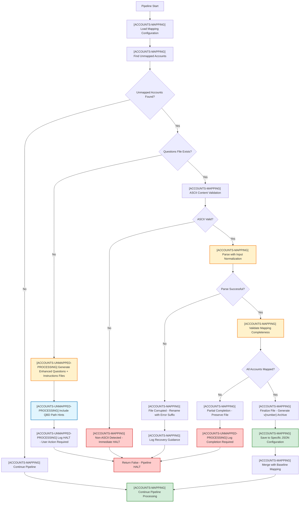

# Mapping Module

## Overview
This module loads, merges, and validates account type mapping files for QBD to GnuCash conversion. It provides lookup services for resolving QBD accounts to GnuCash account types and hierarchy paths, manages comprehensive text-based mapping workflow for unmapped accounts requiring user interaction with QBD path hints, and handles advanced edge cases including ASCII validation, partial completion scenarios, and production-ready error recovery. The module is fully compliant with the latest governance and core PRD standards with complete agentic codegen compatibility.

## File Structure
- `src/modules/accounts/accounts_mapping.py` — Account mapping loader, merger, and complete text-based workflow orchestration with QBD path hints
- `src/modules/accounts/accounts_mapping_baseline.json` — Baseline mapping JSON file with fundamental account type definitions
- `output/accounts_mapping_questions.txt` — Text-based mapping questions for unmapped accounts (active editing workspace)
- `output/accounts_mapping_instructions.txt` — Comprehensive mapping instructions and examples (reference document)
- `output/accounts_mapping_questions_v{number}.txt` — Generational archive of processed mapping questions
- `output/accounts_mapping_specific.json` — User-specific mapping overrides merged from questions workflow
- `prd/accounts/README-accounts_mapping.md` — This file
- `prd/accounts/module-prd-accounts_mapping-v1.3.2.md` — Authoritative PRD for this module

## Design Reference
This module is governed by [Mapping Module PRD v1.3.2](./module-prd-accounts_mapping-v1.3.2.md) and follows the [Governance Model PRD v2.7.0 Section 2](../prd-governance-model-v2.7.0.md#2-structural-rules-and-document-standards). All interface contracts, error handling, and logging are aligned with [Core PRD v3.9.1 Section 7.3](../core-prd-main-v3.9.1.md#73-logging-strategy) and [Logging Framework PRD v1.0.5 Section 5](../logging/module-prd-logging-v1.0.5.md#5-interface--integration). Enhanced with CR-2025-CR-004v1.0.0 for QBD path hints integration.

## Key Responsibilities
- Load and merge mapping files for QBD to GnuCash account types with complete orchestration logic
- Provide exact QBD key lookups with fallback behavior through default rules
- Detect unmapped accounts and manage comprehensive text-based user workflow with QBD path hints
- Generate dual-file system: clean questions workspace + comprehensive instructions reference
- Process and validate mapping questions files with ASCII validation and input normalization
- Handle partial completion scenarios with file preservation for continued user editing
- Implement generational file versioning and archive management for processed questions
- Enforce strict schema validation and production-ready error handling
- Provide console logging with hierarchical tags and standardized messaging patterns
- Support complete file lifecycle from generation through processing with deterministic algorithms

## Enhanced QBD Path Hints Feature
- **Context Integration**: Shows original QuickBooks account names in questions file for informed mapping decisions
- **Format Enhancement**: `QuickBooks import path: {account_name}` provides mapping context from source data
- **Data Extraction**: Leverages QBD account records passed from orchestrator without additional contract changes
- **User Experience**: Eliminates guesswork by showing what the account was called in the source system
- **Implementation**: CR-2025-CR-004v1.0.0 interface contract enhancement with `account_records` parameter

## Enhanced Text Workflow Features
- **Dual File System**: Clean questions workspace (`questions.txt`) + comprehensive reference (`instructions.txt`)
- **ASCII Validation**: Immediate pipeline HALT on non-ASCII characters with descriptive user guidance
- **Partial Completion Handling**: Preserves questions file for continued editing when mappings incomplete
- **Input Normalization**: Automatic case correction and whitespace handling for robust parsing including colon spacing
- **Generational Versioning**: Completed files archived as `accounts_mapping_questions_v{number}.txt`
- **File Priority Logic**: Questions file overrides specific JSON configuration seamlessly
- **Enhanced Instructions**: Comprehensive user guidance with GnuCash fundamental category emphasis
- **Error Recovery**: Structured guidance for malformed input scenarios with clear next steps

## Interface Contracts
- **`load_mapping()`**: Complete orchestration with conditional flow algorithm and file priority management
- **`generate_text_mapping_questions()`**: Enhanced with QBD path hints using account records parameter for context
- **`parse_text_mapping_file()`**: ASCII validation, input normalization, and deterministic parsing logic
- **`validate_mapping_completeness()`**: Partial completion detection for HALT condition coordination
- **`finalize_mapping_file()`**: File lifecycle management based on processing outcome
- **`find_unmapped_types()`**: Unmapped account detection and logging with structured output

## Console Logging Standards
- **Hierarchical Tags**: `[ACCOUNTS-MAPPING]` for configuration operations, `[ACCOUNTS-UNMAPPED-PROCESSING]` for workflow coordination
- **ASCII Compliance**: All console patterns use ASCII characters only for terminal compatibility
- **HALT Condition Messaging**: Clear user action requirements with structured error recovery guidance
- **Progress Tracking**: Detailed processing status with completion validation and file operation confirmation
- **Terminology Precision**: "accounts" for QBD items, "accounting types" for fundamental categories

## Exceptions & Error Handling
- **Primary Exceptions**: `MappingLoadError`, `OutputWriteError` (see [Mapping Module PRD v1.3.2 Section 6.2](./module-prd-accounts_mapping-v1.3.2.md#62-error-classes--exit-codes))
- **Error Code Compliance**: All errors reference [Core PRD v3.9.1 Section 14](../core-prd-main-v3.9.1.md#14-authoritative-error-classes--error-code-table) authoritative registry
- **Logging Integration**: All error events logged per [Logging Framework PRD v1.0.5](../logging/module-prd-logging-v1.0.5.md#6-validation--error-handling) with structured context
- **Edge Case Coverage**: Comprehensive handling including file system errors, input validation failures, and partial completion scenarios

## Production Readiness Features
- **Agentic Codegen Compatible**: Deterministic specifications with algorithmic precision for autonomous implementation
- **Edge Case Robustness**: ASCII validation, input normalization, file system error handling with E0104 compliance
- **User Experience**: Enhanced error messages, clear recovery guidance, and intuitive file lifecycle management
- **Domain Boundary Compliance**: Pure mapping configuration scope with no validation, tree building, or export logic
- **Interface Authority**: Full compliance with Core PRD precedence hierarchy and governance model structural requirements

## Enhanced Questions File Format

**Clean Workspace (`accounts_mapping_questions.txt`):**
```
Where should these accounts go in GnuCash?

[MISC_LABOR_INCOME]
QuickBooks import path: Contractor Income
Enter the full GnuCash account path here: 

================================================================================
WARNING: ASCII only (A-Z, 0-9, basic punctuation). Special characters cause failure.
REQUIREMENT: Must start with Assets | Liabilities | Equity | Income | Expenses

Enter full account path using colons: "Income:Service Revenue:Labor"
See accounts_mapping_instructions.txt for examples and detailed help.
```

**Comprehensive Reference (`accounts_mapping_instructions.txt`):**
- Detailed mapping instructions for GnuCash account conversion
- The 5 fundamental accounting types with examples
- Account path examples for each category
- Hierarchy rules and completion checklist
- QuickBooks Desktop Chart of Accounts guidance

## Workflow Integration


## Dependencies
- **Python Modules**: `typing`, `json`, `os` for core functionality
- **Error Handling**: `utils.error_handler` for standardized exception classes
- **Logging**: `utils.logging` for centralized logging configuration
- **External PRDs**: Logging Framework PRD v1.0.5, Core PRD v3.9.1 for compliance and error registry
- **Interface Enhancement**: CR-2025-CR-004v1.0.0 for QBD path hints integration

## Revision History
| Version | Date       | Author | Summary                           |
|---------|------------|--------|-----------------------------------|
| v1.1.0  | 2025-06-11 | PJ     | Initial README aligned with PRD v1.1.0 text workflow integration |
| v1.3.2  | 2025-06-12 | PJ     | Complete update for PRD v1.3.2: enhanced text workflow, ASCII validation, partial completion handling, console logging standards, agentic compatibility, production readiness features |
| v1.4.0  | 2025-06-13 | PJ     | CR-2025-CR-004v1.0.0 integration: QBD path hints feature, dual-file system documentation, enhanced workflow diagrams, interface contract updates, terminology precision improvements |